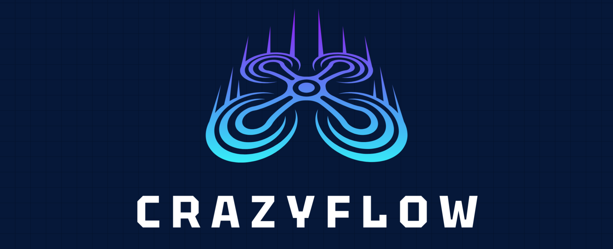
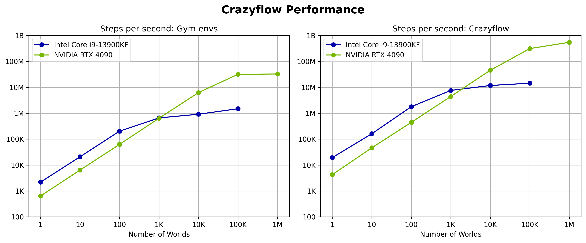

# Crazyflow - Simulation Software

[Crazyflow :simple-github:](https://github.com/utiasDSL/crazyflow) is a high-performance simulation framework for Crazyflie drones that leverages JAX for efficient parallelization and automatic differentiation. The architecture is designed around a flexible pipeline that can be configured at initialization time, enabling users to swap out physics backends, control methods, and integration schemes.

### Simulation Pipeline
The simulation is built as a pipeline of functions that are composed at initialization time based on the configuration. This approach avoids runtime branching and allows JAX to optimize the entire pipeline as a single computation. Users can insert their own pure functions into the pipeline to modify the simulation behavior while maintaining compatibility with JAX's optimizations.

### Physics Backends
Multiple physics models are supported:
- analytical: A first-principles model based on physical equations
- sys_id: A system-identified model trained on real drone data
- mujoco: MuJoCo physics engine for more complex interactions

### Control Modes

Different control interfaces are available:
- state: High-level control of position, velocity, and yaw
- attitude: Mid-level control of collective thrust and orientation
- thrust: Low-level control of individual motor thrusts

### Integration Methods

For analytical and system-identified physics:

- euler: Simple first-order integration
- rk4: Fourth-order Runge-Kutta integration for higher accuracy

## Parallelization

Crazyflow supports massive parallelization across:

- Worlds: Independent simulation environments that can run in parallel
- Drones: Multiple drones within each world
- Devices: Computations can be executed on CPU or GPU This parallelization is achieved through JAX's vectorization capabilities, allowing thousands of simulations to run simultaneously with minimal overhead.

## Domain Randomization
The framework supports domain randomization through the crazyflow/randomize module, allowing parameters like mass to be varied across simulations to improve sim-to-real transfer.

## Functional Design
The simulation follows a functional programming paradigm: All state is contained in immutable data structures. Updates create new states rather than modifying existing ones. All functions are pure, enabling JAX's transformations (JIT, grad, vmap) and thus automatic differentiation through the entire simulation, making it suitable for gradient-based optimization and reinforcement learning.

## Examples
The crazyflow repository includes several example scripts demonstrating different capabilities: `hover.py`, `thrust.py`, `render.py`, `contacts.py`, `gradient.py`, `change_pos.py` 

## Performance

The chart above shows the performance of Crazyflow on different hardware. The simulator can achieve close to 100 million steps per second on a GPU with 1 million parallel environments. The gym environment, which includes additional overhead for the Gymnasium interface and is not fully optimized, still achieves decent performance with over 98,000 steps per second on GPU with 10,000 parallel environments.

Performance benchmarks were run on:

    CPU: Intel Core i9-13900KF
    GPU: NVIDIA RTX 4090

To reproduce the benchmark results, rerun the `benchmark/main.py` script.