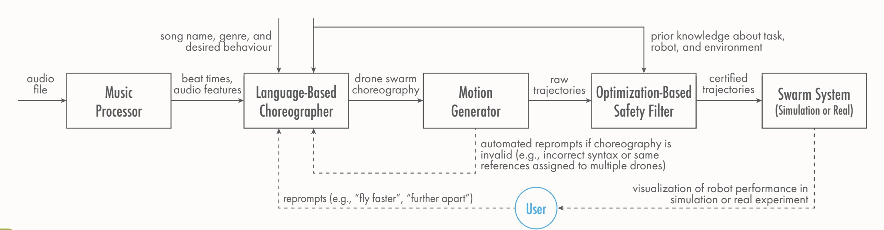

# Getting started with SwarmGPT

Here is a diagram showing the overview of the framework.



The following video explains how the framework works in greater depth:
<video width="640" height="360" controls>
  <source src="../media/video/overview.mp4" type="video/mp4">
  Your browser does not support the video tag.
</video>

Overview

1. Install [SwarmGPT :octicons-mark-github-24:](https://github.com/utiasDSL/swarmGPT), the required packages and the other necessary repositories: [Crazyflow :octicons-mark-github-24:](https://github.com/utiasDSL/crazyflow), [Axswarm :octicons-mark-github-24:](https://github.com/utiasDSL/axswarm), [Crazyswarm :octicons-mark-github-24:](https://github.com/USC-ACTLab/crazyswarm).
2. Enter the initial positions of the drones in the `crazyflies.yaml` configuration file.
3. Run the interface and simulate and deploy the drones.


## 1. Installing SwarmGPT and other packages

SwarmGPT requires ROS Noetic on Ubuntu 20.04 which does not harmonize with most virtual environments like venv or conda. So, one must create a pixi environment and install packages within that or install directly into the default python environment. 

_... install from source:_

```bash
git clone https://github.com/utiasDSL/swarmGPT.git
cd swarmGPT
```

_...optional: work in a new pixi environment_
```bash
pixi install
pixi shell 
```

After your pixi environment is set up, the following ROS packages need to be installed:

- crazyswarm: follow these [instructions](https://crazyswarm.readthedocs.io/en/latest/installation.html) - instructions must be replaced once githubio is set ups
- axswarm: follow these [instructions](https://github.com/utiasDSL/axswarm)
- crazyflow: follow these [instructions](https://github.com/utiasDSL/crazyflow)


## 2. Configure the Drones

The IDs of the crazyflies, their initial positions, and channels must be entered into `crazyflies.yaml`. This configuration file can be found in `ros_ws/src/crazyswarm/launch/crazyflies.yaml` and follows this structure:

```yaml
crazyflies:
- channel: 100
  id: 1
  initialPosition: [1., 1., 1.]
  type: medium
...
```

## 3. Run the Interface and Simulate and Deploy the Drones

To run the interface navigate to `swarmGPT/swarm_gpt` and run

```bash
python3 launch.py
```

From there you can select the song and have the LLM generate choreography for it. You can simulate the choreography and reprompt the LLM if you don't like it. Below is an instructional video on how to use the interface:
<video width="640" height="360" controls>
  <source src="../media/video/interface_video.mp4" type="video/mp4">
  Your browser does not support the video tag.
</video>

Before you deploy the dances onto the crazyflies, run the communication launch in a separate terminal by `roslaunch crazyswarm hover_swarm.launch`. Don’t forget to source the ros_ws by source `ros_ws/devel/setup.bash`, if you get crazyswarm ros package is not recognized. Or you can put the source command into your `~/.bashrc` script.

In addition, if you want to test if the crazyflies are properly connected, you can open a third terminal, navigate to `ros_ws/src/crazyswarm/scripts/` and execute `python3 niceHover.py`. It will hover all the connected crazyflies and land all of them once you press any button.

