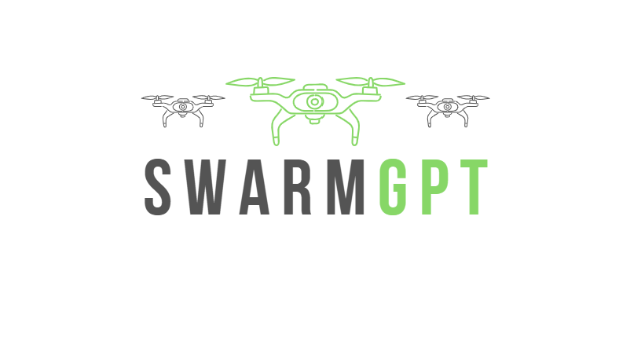

# SwarmGPT: Using LLMs to Control Drone Swarms 



*Authors: [Martin Schuck](https://amacati.github.io/), [Dinushka Orrin Dahanaggamaarachchi](https://scholar.google.com/citations?user=owkYhHwAAAAJ&hl=en), [Ben Sprenger](https://bsprenger.github.io/), [Vedant Vyas](https://vedudx.github.io/), [Siqi Zhou](https://siqizhou.com), and [Angela P. Schoellig](https://schoellig.name/).*

> A system that integrates large language models (LLMs) with safe swarm motion planning - offering an automated and  novel approach to deployable drone swarm choreography. Swarm-GPT enables users to automatically generate synchronized drone performances through natural language instructions. With an emphasis on safety and creativity, Swarm-GPT integrates the creative power of generative models with the effectiveness and safety of model-based planning algorithms.

**_If you use this work, please cite it using the [bibtex](#citing) below._**

We run [SwarmGPT :simple-github:](https://github.com/utiasDSL/swarmGPT) on crazyflies using [crazyswarm :simple-github:](https://github.com/USC-ACTLab/crazyswarm). We use [axswarm :simple-github:](https://github.com/utiasDSL/axswarm) as our safety filter to prevent crashes and simulate our swarms using [crazyflow :simple-github:](https://github.com/utiasDSL/crazyflow).

<iframe width="560" height="315" src="https://www.youtube.com/embed/a-4-afszP8w?si=Lc-KoX9rj08dIItP" title="YouTube video player" frameborder="0" allow="accelerometer; autoplay; clipboard-write; encrypted-media; gyroscope; picture-in-picture; web-share" referrerpolicy="strict-origin-when-cross-origin" allowfullscreen></iframe>
Drone swarm of 8 drones dancing to Clair de Lune by Claude Debussy.

## Why?

In the past, drone choreographies have been very difficult to program. SwarmGPT is an intuitive way to create complex choreographies, as users can talk in natural language to an LLM that will create waypoints and then a choreography using predefined motion primitives for the drones. The user can read the choreography, and if they do not like it, reprompt the LLM to create a different one. Once the user is happy with the choreography, it is sent to our safety filter. The JAX-based safety filter, called axswarm, will "fill in the gaps" between the waypoints and ensure safe choreography and prevent crashing. Then the choreography is simulated using our mujuco-based simulation software, crazyflow, before being deployed in real life.

SwarmGPT ensures that anyone, regardless of their background or technical skills, can create and deploy drone choreographies. 


## Features
- User-friendly UI that allows users to interact with SwarmGPT using natural language. No Technical skills required to use.
- Utilizes a high-speed, research-grade trajectory planner for drone swarms, now fully reimplemented in Python using JAX for automatic differentiation and GPU/TPU acceleration. 
- Simulates the drones in Crazyflow. A high-performance simulation framework that leverages JAX for efficient parallelization and automatic differentiation. 

## Citing

```bibtex
@article{schuck2025swarmgpt,
  title={SwarmGPT: Combining Large Language Models with Safe Motion Planning for Drone Swarm Choreography},
  author={Schuck, Martin and Dahanaggamaarachchi, Dinushka Orrin and Sprenger, Ben and Vyas, Vedant and Zhou, Siqi and Schoellig, Angela P.},
  journal={IEEE Robotics and Automation Letters},
  year={2025},
  publisher={IEEE}
}
```
